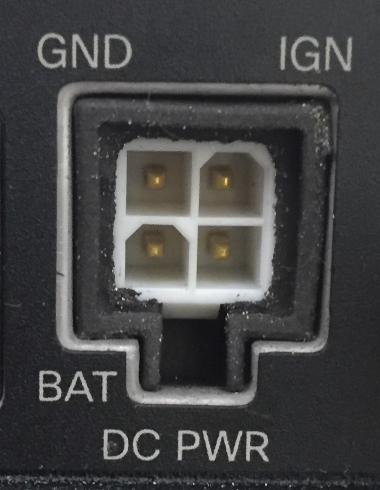

#How to Provide Power to Your IR829

When I received my IR829 I opened the box with the expectation of
taking it out, plugging it and starting to work with it. BUT, it was
not shipped with a Power Supply Unit (PSU), so I was somewhat
dissapointed instaed.

If that happens to you, then what I have written here may help you.

##What the IR829 is Supposed to do for Power

The IR829, as originally conceived, was designed to go into
vehicles. To make that simple, it comes with an on-board power adapter
suitable for the 12v-24v DC power supply that is standard in
vehicles. This makes perfect sense for the original intended use.

Outside of the vehicle environment, though, 12v-24v, 5A, 60-120W power
sources are not that common.

