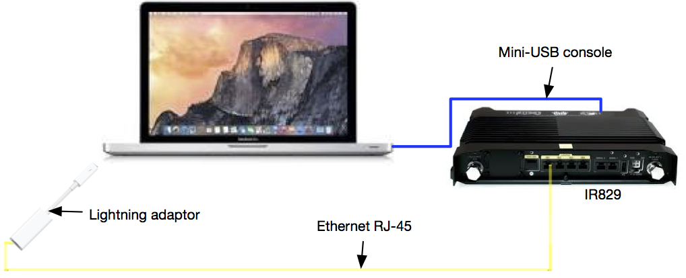

#How to Connect Your Laptop to an IR829 or an IR809

The diagram above illustrates a basic setup to get your laptop connected to a IR829/809 and in a position to start with developing applications, deploying them into the IOx Yocto Linux Guest Operating System (GOS) on the IR829/809, and seeing what happens. This guide requires the contents of what is shipped in the IR829/809 box, a small Philips screwdriver to unscrew the panel over the mini-USB port, and a suitable [power supply](https://github.com/DevOps4Networks/IOX-Notes/blob/master/8x9_PSU/README.md).
 
A typographical note for below: I use IR8x9 to mean both the IR829 and IR809 for the purposes of this post. Note that this does NOT include the IR819, which is quite different.
 
To get started here, you need to have the following working for you:
 
•	Console connectivity from your laptop, using the blue mini-USB console cable, so that you can configure the IR8x9.
•	The IR8x9 booting to IOS, which may not happen automatically.
•	Ethernet IP connectivity between the IR8x9 and your laptop, so that you can connect your laptop development tools, browser and so on, to the GOS on the IR8x9, using the yellow Ethernet RJ45 cable (not included in the box my IR809 came in).
•	A connection to the GOS Local Manager web UI, using your laptop.
•	Trivial File Transfer Protocol (TFTP), or similar, so that you can install new IOx bundles and/or IOS images and/or GOS images as they are made available, using your laptop.
 
The console connectivity aspects are dealt with [here](https://github.com/DevOps4Networks/IOX-Notes/blob/master/How_To_Connect_The_Console/README.md).
 
Booting the IR8x9 to IOS is dealt with in this post: How to Boot to IOS from rommon-2, and Not Have to do That Again.
 
Setting up TFTP to copy new bundles to the IR8x9 is discussed in this post: How to Set up a TFTP Server on OS X, Windows or Linux. Installing new bundles is discussed in this post: How to Install IOx Bundles on the IR829 or IR809
 
The rest of this post addresses the ethernet IP connectivity for IOS and the GOS, and connecting to the Local Manager web interface.
 
Please leave a comment if this does not work for you, or you can help improve these instructions.
 
Ethernet IP Connectivity
 
Before I go into the details of the configuration, I will explain some of the characteristics of the IR8x9 devices. One side of the IR829 has the mini-USB console port, where you will have connected the blue mini-USB console cable if you followed the instructions above. The other side has the ports labelled GE0 to GE4, Serial 1 and Serial 2, a USB port and a power socket.
 
The IR829 GE0 port is a Wide Area Network (WAN) port. We won't be using that for the time being (you would need an SFP and I don't have one to test at the time of writing) . The GE1-4 ports are "switch" ports. In effect, the IR829 combines a router, with the GE0 port, with a four port switch. It is the GE1-4 switch ports that will be configured to connect to your laptop.
 
The IR809 differs from the IR829 in that it does NOT have the four switch ports that the IR829 has. The IR809 has two external WAN ports, GE0-1, in between the two serial ports and the USB, power and mini-USB ports.
 
The general idea here is that the IR8x9 will be configured with DHCP so that, when you plug an ethernet cable into your laptop, and plug the other end of the cable into one of the appropriate ethernet ports on the IR8x9, your laptop will be given an IP address via DHCP. The rest of the configuration then connects the network your laptop is on to the GOS, and then you are away!
 
If you have connected a console cable, and have succesfully booted the IR8x9 to IOS, and have NOT configured it, then you will be in the right position to start. If the IR8x9 has some form of configuration on it already, then you can see what that is by using the "show run" command in "enable" mode, copy it and save it for later if you need it.
 
The "enable" mode, also known as "privileged exec" mode, is reached by entering "enable" at the IOS CLI. The visual clue that you are NOT in enable mode is that the CLI prompt ends with a '>' symbol. If you are in enable mode, then the CLI prompt ends in a '#' symbol.
 
If there is configuration on the IR8x9, and you have saved that, or you don't need that, then you can reset the IR8x9 to factory settings as explained here: Re: How to reset the IR829 to factory settings.
 
The configuration we will use for the IR829 is in GitHub here, and the configuration for the IR809 is here. Those configurations are designed to be copied and pasted into a console window (STOP! you need to think and edit before you do that. Look for the "EDIT ME!" comments). To use them, you need to use the console to put IOS on the device into "enable" mode, as discussed above. Note that there will not be a password required, yet, as you have not configured one. You should see something like this:
 
IR800> enable
 
Then you can copy-and-past the configuration attached, AFTER having read it, understood the parts you need to change (EDIT ME!), and changed them. The configuration itself is commented where the comment marker is a "!". If this goes wrong for any reason, don't worry, you can reset the device and try again, as discussed here: Re: How to reset the IR829 to factory settings
 
Connecting to the GOS
 
After having applied the configuration, the GOS should have been started automatically, and given the IP address of 192.168.2.2 (unless you changed the configuration, in which case you know what the address will be). In the console you should see messages like this:
 
*Feb 29 09:29:22.011: %IOX-6-SECOND_CONNECT: Received second socket connect from same IOX Client. Closing first session
*Feb 29 09:29:22.011: %IOX-6-SOCK_CONNECT: Received socket connection request from IOX Client
*Feb 29 09:29:25.063: %IOX-6-SOCK_MESSAGE: Received IOX_REQUEST message with opcode IOX_REQUEST_REGISTER from IOX Client
 
And the "show iox host list detail" command (in enable mode) should show you something like this:
 
IOX Server is running. Process ID: 323
Count of hosts registered: 1
 
Host registered:
===============
    IOX Server Address: FE80::662:73FF:FEBB:8EEC; Port: 22222
 
    Link Local Address of Host: FE80::1FF:FE90:8B05
    IPV4 Address of Host:       192.168.2.2
    IPV6 Address of Host:       fe80::1ff:fe90:8b05
    Client Version:             0.3
    Session ID:                 2
    OS Nodename:                IR829-DevTest-GOS-1
    Host Hardware Vendor:       Cisco Systems, Inc.
    Host Hardware Version:      1.0
    Host Card Type:             not implemented
    Host OS Version:            2.0
    OS status:                  RUNNING
 
    Interface Hardware Vendor:  None
    Interface Hardware Version: None
    Interface Card Type:        None
 
    Applications Registered:
    =======================
        Count of applications registered by this host: 0
 
Assuming that you do see the output above, or something very close to it, specifically with a value for the "IPV4 Address of Host" field, then you will be able to connect, from the laptop connected to one of the GE1-4 ports on the IR829, or the GE0-1 ports on the IR809, and via a web browser to the Local Manager web interface.

I recommend disabling all other network interfaces, e.g. WiFi, on your laptop, apart from the one connected to the IR8x9, just in case there is a collision between the networks that the IR8x9 provides, and other networks reachable by your laptop on a different network interface. Once you are certain that all of this is working, you can re-enable the other network interfaces on your laptop and check again.

If there is an issue with connectivity when your laptop has multiple network interfaces enabled, then you will need to change the networks in the configuration so that there is no overlap. For example, I had a 192.168.2.2 address reachable via my DSL provider connection, so I tested all of this with only the ethernet connection to the IR8x9 enabled.
 
Note that it can take up to five minutes for the GOS to start, and sometimes only a few seconds. If the GOS does not start after five minutes, try to stop and start it again, like this (note that this sample is from an IR829, but the IR809 is the same):
 
IR829-DevTest#guest-os 1 stop
Stopping Guest OS ...... Done!
 
IR829-DevTest#
*Feb 29 10:19:46.245: %IR800_INSTALL-6-SUCCESS_GOS_OPERATION: Successfully performed STOP operation for GOS.
IR829-DevTest#guest-os 1 start
Starting Guest OS ...... Done!
 
IR829-DevTest#
*Feb 29 10:19:58.957: %IR800_INSTALL-6-SUCCESS_GOS_OPERATION: Successfully performed START operation for GOS.
 
You might see a message like this:
 
*Feb 29 10:20:08.265: %IOX-6-HEARTBEAT_TIMER_EXPIRED: IOX Heartbeat timer expired.
 
That seems to informational only, as the GOS does start eventually.
 
You can connect to the Local Manager web UI with a browser like this (note that the "https://" part of the URL is required):
 
https://<GOS IP address>:8443
 
The web page that should be presented will allow you to log in with the credentials that you configured with this line in the attached configuration file (which you should have changed to use credentials specific to your environment):
 
username cisco privilege 15 password 0 cisco
 
Note that the port number of 8443 is non-standard, and that the HTTPS certificate is self-signed.
 
That's it. Good luck, and please leave a comment if this does not work for you, or you can help improve these instructions.
