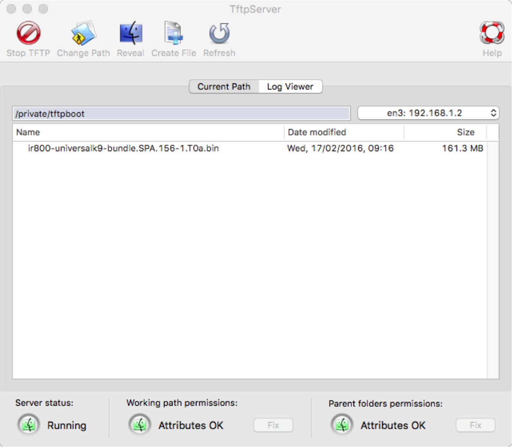

#How to Set up a TFTP Server on OS X, Windows or Linux

You can run a TFTP server on Windows, OSX or Linux that you can use to transfer new images and bundles to your
devices. Whilst running a TFTP server is quite well understood and documented, there are a few, small but 
important, details that make the difference between something that ought to work, and actually does work. I 
have tested TFTP on Windows 10, OSX El Capitan 10.11 and Ubuntu 14.04 LTS. The notes below explain what I had 
to do to get TFTP to work on those different platforms.
 
In all cases, I attached the laptop (running Windows/OSX/Linux) with an Ethernet cable to one of the GE1-4 
switch ports on an IR829, or one of the GE0-1 ports on a IR809, and used a configuration based on 
[these example configurations](https://github.com/DevOps4Networks/IOx-Sample_Configurations).
This means that the TFTP server had an address in the 10.42.1.0 network.
 
##OS X El Capitan 10.11
 
OS X is a Unix based operating system, so the TFTP service is built in. It is probably perfectly possible, 
in theory, to run the TFTP service from the CLI, and how to do is fairly well documented if you search for 
that, for example [here](http://www.barryodonovan.com/2014/11/08/os-x-built-in-tftp-server).
 
In the process of searching you may also discover that, with El Capitan, 10.11, specifically, the method of 
using the `launchctl` command seems not to work for reasons that are not clear. What is generally recommended 
is that one uses this [TFTP Server UI utility](http://ww2.unime.it/flr/tftpserver/), which is what I did. 
Importantly, though, I also had to make the `/private/tftpboot directory` accessible by all, like this:

```bash 
sudo chmod a+rwx /private/tftpboot
``` 
 
Combined with selecting the appropriate interface for the service, as illustrated below, I was able to use my 
MacBookPro running 10.11.4 as a TFTP server, which looks like this:


 
If you do use the TFTP Server utility, note that a donation of $12 would be greatly appreciated by the author.
 
##Windows 10
 
A TFTP server for windows 10 has to be installed from a third party. I used a (free) one from 
[Solarwinds](http://www.solarwinds.com/products/freetools/free_tftp_server.aspx). 

To allow connections to the TFTP server, I had to add an entry to the firewall to allow UDP on port 69. 
These [instructions](http://windows.microsoft.com/en-us/windows/open-port-windows-firewall#1TC=windows-7) are 
for Windows 7, but the steps also worked on Windows 10.
 
##Linux - Ubuntu 14.04 LTS
 
I don't think that these instructions are specific to any given version of Linux, apart from using the 
`apt-get` command to install the `tftpd-hpa` package, but I will note that I tested on the 14.04 LTS Ubuntu 
version of Linux. There are many documented ways of installing and running TFTP on Linux. The following is 
what I did:

```bash 
sudo apt-get install tftpd-hpa
```

That step installs and starts the tftp service. The default directory for files is `/var/lib/tftpboot`, and it 
needs to have its permissions changed like this:

```bash 
sudo chmod -R 777 /var/lib/tftpboot
```
 
That's it. Good luck, and please open an issue if this does not work for you, or you can help improve these 
instructions.
